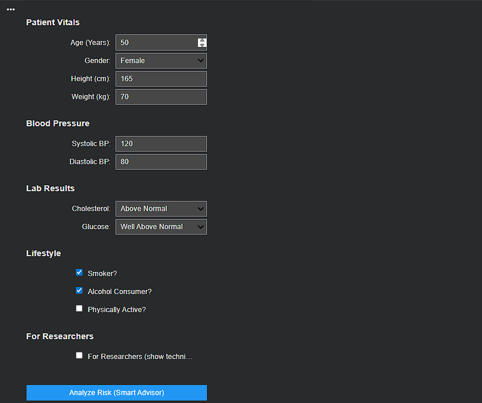
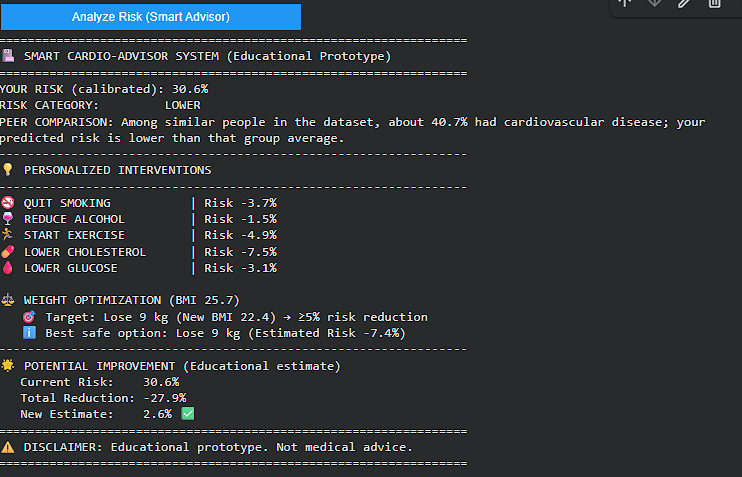

# Responsible & Interactive Cardiovascular Risk Assessment
### A Hybrid Machine Learning Approach with Safety Constraints

## 📖 Project Overview
Cardiovascular disease remains a leading cause of global mortality. While Machine Learning (ML) offers powerful predictive capabilities, standard "black-box" models often lack the safety mechanisms required for healthcare deployment.

This project introduces a **Hybrid Safety Architecture**. It combines a high-performing Gradient Boosting classifier with a deterministic "Safety Layer" that ensures the AI never gives advice that contradicts established medical literature.

## 🚀 Key Features
* **Multi-Model Benchmarking:** Comparative analysis of Logistic Regression, Random Forest, and Gradient Boosting.
* **Safety Override Logic:** A hard-coded medical logic layer that intercepts and corrects erroneous AI predictions.
* **Interactive Smart Advisor:** A tool that calculates the "minimal effective dose" of lifestyle change to lower patient risk.
* **Responsible AI Audit:** Verified for fairness with a negligible Equalized Odds Gap of 0.010.

## 📊 Performance Summary
| Metric | Result |
| :--- | :--- |
| **Accuracy** | 73.6% |
| **ROC-AUC** | 0.802 |
| **Gender Fairness** | < 0.010 |

 **Gender Fairness (Equalized Odds Gap)** | < 0.010 

## 🛠️ Installation & Usage
To run this project on your local machine:

1. **Install Dependencies:**
   Run this command in your terminal:
   `pip install pandas scikit-learn matplotlib numpy`

2. **Run the Notebook:**
   Open `872.ipynb` in Jupyter Notebook or upload it to Google Colab.

3. **Data Requirements:**
   Ensure `cardio_train.csv` is in the same folder as the notebook.

---

## 📂 Project Structure
* **872.ipynb**: Full source code and interactive tool.
* **priyesh-872-finalReport.pdf**: Detailed research paper.
* **cardio_train.csv**: Dataset (70,000 records).

---

## 🎓 Author & Credits
**Author:** Priyesh Vashistha  
**Institution:** Department of Electrical and Computer Engineering, Queen's University  
**Data Source:** Cardiovascular Disease Dataset from Kaggle  

---
**Disclaimer:** This tool is for educational purposes only and is not a substitute for professional medical advice.
